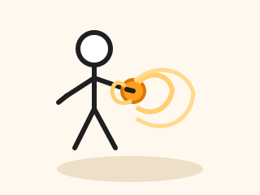

<html lang="en">
<head>
    <meta charset="UTF-8">
    <meta name="viewport" content="width=device-width, initial-scale=1.0">
    <title>Ulrik siger ikke nej, men tak for kage!</title>
</head>
<body>
    <!-- <h1>Ulrik siger ikke nej, men tak for kage!</h1> -->
    

Ulrik siger ikke nej, men tak for kage!

    
    

        
    

    

        
&#9856;

        <button id="roll-button" type="button">Roll dice</button>
    

    <!-- Image inserted from a URL -->
    

</body>
</html>
